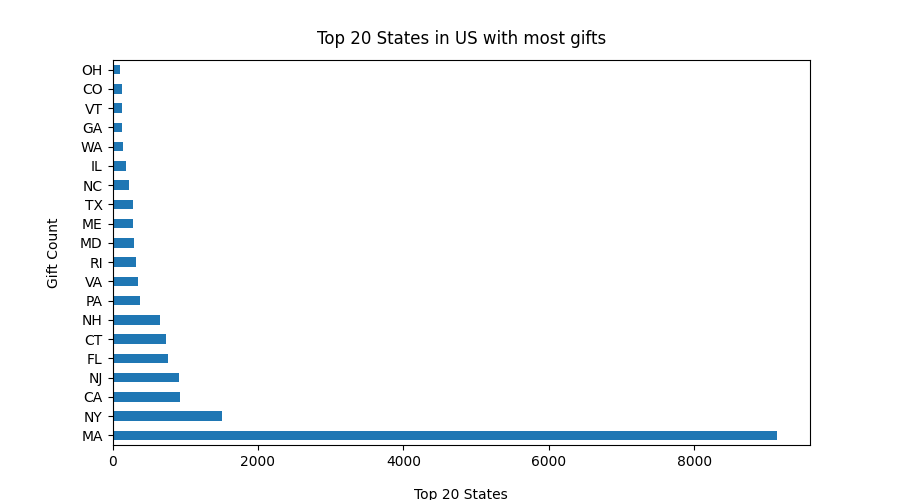
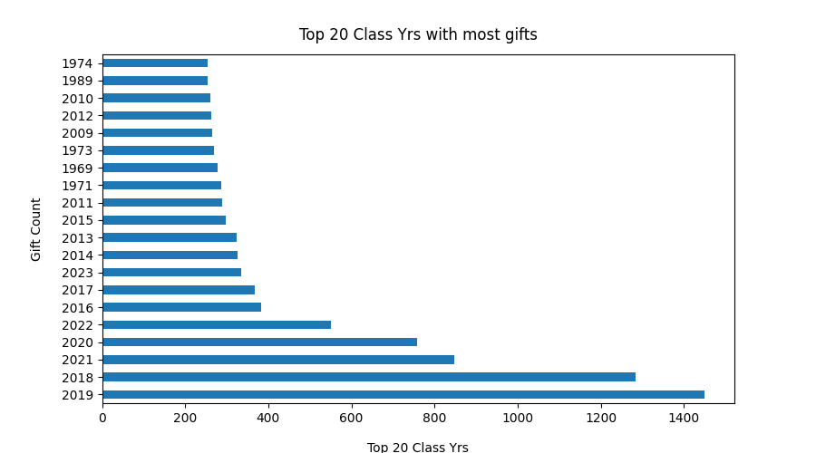

# Propensity Model for Alumni Donors at Northeastern University

The goal of this project was to build a propensity model that could accurately predict the likelihood of an alumni donor making a donation to the University. The model was trained on historical data of past donations and utilized various demographic and behavioral factors that may influence a donor's decision to donate. These may include factors such as age, gender, education level, income, and past engagement with the University. 
The ultimate goal was to use the model to target potential donors with personalized communication and messaging, ultimately increasing donation revenue for the University.

## Data Collection
The University's records was used to collect data on past donations, including the amount of the donation, the donor's demographic information, and other relevant factors. 

## Data Cleaning & Exploratory Data Analysis
The **EDA.py** file was used to better understand the data content and find the best variables to build the propensity model. 
The data contains the following variables:

NUID = unique ID for donors 
AMOUNTTODESIGNATION = gift amount that was designated to a fund of donor's choice 
DESIGNATIONCODE = fund code 
LIFETIMECOMMITEMNTS = all gift and pledge payments and expected pledge payments for ALL open pledges, including revocable, in the system to date. Does not include matching gift for individual donors. 
FISCALYEAR = fiscal year (Jul1 to Jun30) the gift was received (from 2018 to 2022) 
GIFTTYPE = 'category' the gift falls in 
GENDER = donor's gender 
PRIMARYCLASSYEAR = donor's class year 
PRIMARYACADEMICUNIT = donor's primary academic unit 
HOMECITY = city where donor lives (that we have on record) 
HOMESTATE = state where donor lives (that we have on record) 
RESEARCHRATING = prospect's overall financial ability to make charitable contributions to all organizations over 5 yrs period. Based on % of their public assets, indicator of wealth, and/or estimate net worth. Ratings do not consider debt as a factor in these calculations 
EMPLOYER = company where donor works (that we have on record) 
TITLE = donor's title at the company where donor works (that we have on record) 

Some interesting findings:
1. State of Massachusetts ranks 1st place in the top 20 states where donors currently reside, followed by New York and California

2. Class of 2019, 2018 and 2021 ranks 1st, 2nd and 3rd places respectively in the top 20 Class Years donors graduated from with higher gift count. It shows that the University has engaged recent grads to the culture of giving.

3. Gift Type "Pledge" has higher giving amounts, which makes sense since it's the total amount the donors commits to giving in a certain period of time.

4. The majority female donors are alumni from these schools: BHS, CAM, CSC. On the other hand, the majority male donors are from these schools: COE, CPS, CSH, DMSB, KCCS. 
5. Male donors are the majority for all research ratings available. 
6. Research Ratings with higher ranges have less donors from recent graduation years. That makes sense considering that these people at this age are starting their careers, therefore their overall financial situation are generally not the same as someone at a mature level in their careers. 
7. In addition, recent class years have a higher gift count, but not higher amounts. That's due to the University's strategy in encouraging the practice of giving (any amount, usually low) when students are in their senior year. 
8. Around 54% of donors fall in the Research Rating range of $ 25k to $ 250k. 

## Job Titles Analysis
The main goal with job titles analysis was to better understand giving patterns for "Leadership" and "Middle & Lower Management" categories. 
"Job Title" field in the database is a free-text field, so the user can input random text in it. That adds a layer of complexity in the analysis, and some cleaning was necessary. 
The **"Job Title Analysis.py"** file contains all the steps necessary: remove stopwords, change the format to strings, tokenize the words, and words classification for the categories. 
It was interesting to see that the "Middle & Lower Management" category has a higher gift count than the "Leadership" category (7,258 vs 1,169 respectively) but lower total giving amount ($ 5,805,825.94 vs $ 12,602,364.44 respectively), showing they give with higher frequency but lower amounts than the latter.

## Modeling
The **"Modeling.py"** file trains, tests and evaluates each model's performance and displays accuracy and a classification report. The script also generates visualizations of ROC curves and confusion matrices. 
The data was cleaned and preprocessed to ensure that it is accurate and ready for analysis. This includes removing any duplicates or missing values and standardizing the data format. Besides, donors’ identities will be preserved for data security purposes. 
After loading the dataset and preprocessing it, 4 different machine learning algorithms were trained and tested: Random Forest, Decision Tree, Naive Bayes and K-Nearest Neighbors. 
The output for each model includes: 
1. Accuracy: is the proportion of correctly predicted instances (both true positives and true negatives) out of the total instances. It gives a general sense of how well the model is performing overall. 

2. Classification Report: Provides more detailed metrics including precision, recall, and F1-score. These metrics are calculated using the confusion matrix. The classification report also includes the support, which is the number of instances in each class in the test dataset. 
   - Precision: Precision is the ratio of true positives to the total number of instances predicted as positive. It indicates how well the model is performing when it predicts a positive class. 
   - Recall: Recall, also known as sensitivity or true positive rate, is the ratio of true positives to the total number of actual positive instances. It shows how well the model is capturing the positive instances. 
   - F1-score: The F1-score is the harmonic mean of precision and recall. It provides a balanced measure of a model's performance, considering both false positives and false negatives. 
   - Support: Support is the number of actual occurrences of the class in the specified dataset. 

3. Macro and Weighted Averages: These are additional metrics calculated as averages across the classes. Macro average calculates metrics independently for each class and then takes the average. Weighted average takes into account the proportion of each class in the dataset. 

Below are the results interpretation for each model:

*Random Forest:*

Accuracy: 0.87 (87%) 
Precision and recall are both relatively balanced for both classes. 
F1-scores are also balanced, indicating a good trade-off between precision and recall. 
Both classes have reasonable support. 
The model performs well overall with balanced precision and recall. 

*Decision Tree:*

Accuracy: 0.83 (83%) 
Precision and recall are relatively balanced for both classes. 
F1-scores are also relatively balanced. 
The model performs well but might have some room for improvement. 

*Naive Bayes:*

Accuracy: 0.46 (46%) 
Precision is higher for class 1 (donor), but recall is much higher for class 0 (non donor). 
F1-score for class 1 is reasonable, but for class 0, it's quite low. 
The model seems to perform poorly overall, especially in terms of classifying positive instances. 

*K-Nearest Neighbors:*

Accuracy: 0.59 (59%) 
Precision and recall are relatively balanced for both classes. 
F1-scores are also balanced. 
The model performs reasonably, but there's room for improvement. 

In summary, based on these results, the Random Forest model seems to be performing the best among the four models evaluated, as it has the highest accuracy and balanced precision and recall for both classes. The Naive Bayes model, on the other hand, seems to have the poorest performance, with imbalanced precision and recall for class 0. The Decision Tree and K-Nearest Neighbors models fall in between.

## Future Improvements
While the initial model provides a solid foundation, there are several areas where further improvements could enhance its performance and predictive capabilities. 

In terms of feature engineering, we could explore additional features or transforming existing ones, providing more relevant information to the model. 
For instance, alumni from other countries could be included in this analysis, as the University has been expanding not only domestically, but also exploring other countries. Variables related to alumni engagement could also be used (volunteering, events attendance, tutoring, etc).
Moreover, additional fiscal years worth of data could be included in order to feed the models with more data (potentially, more donors). 

The job title analysis was really helpful because it allowed us a broader understanding on how they relate and influence giving. As it was mentioned before, the "Job Title" field in the database is a free-text field, so the user can input random text in it. That adds a layer of complexity in the analysis, and some cleaning was necessary. 
Would be intesting to explore a more detailed job titles classification (more levels, or classification per industry for example). That could lead to other ideas to be explored and possible a more strategic resource allocation when reaching out for donations. 

Another improvement would be fine-tuning the hyperparameters of the Random Forest, Decision Tree, and K-Nearest Neighbors models that could potentially lead to better results. Techniques like grid search or randomized search could help systematically search for optimal hyperparameter combinations.
Besides, we could consider experimenting with other advanced classification algorithms such as Gradient Boosting, Support Vector Machines, or Neural Networks. Different algorithms might capture complex relationships in the data better and improve overall predictive performance.

Collaborating with domain experts such as frontline fundraisers and other universities with similar fundraising approaches would help to gain deeper insights into the factors that drive donor contributions, which could lead to feature creation that is more aligned with real-world factors.

Improving a propensity model is an iterative process that requires experimentation, analysis, and domain expertise. The key is to continually assess and refine the model to make it more accurate and effective.

